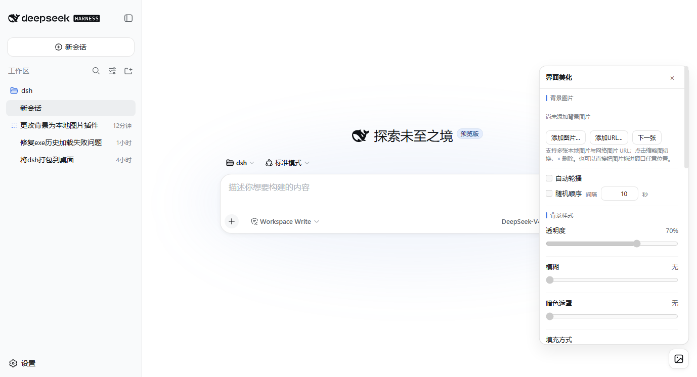

# dsh-ui-background

DeepSeek Harness Web 界面美化插件（对齐主流 VSCode 背景插件能力 + 差异化增强）。



## 功能

### 背景
- **多图片列表** — 支持多张本地图片与网络图片 URL 混排；点击缩略图切换、× 删除；「下一张」快捷按钮（多图时显示在右下角）。
- **自动轮播 / 随机** — 按设定间隔自动切换，可选随机顺序。
- **透明度** — 0–100% 滑杆。
- **模糊** — 0–30px 高斯模糊（自动扩展图层避免边缘虚化露白）。
- **暗色遮罩** — 0–80% 黑色遮罩层，保证文字可读性。
- **填充方式** — 铺满（裁切）/ 完整显示 / 拉伸填满 / 平铺重复。
- **宽度 / 高度** — 滑杆 + 手动输入像素值（0 = 按填充方式）；「保持宽高比」开关按图片原始比例联动。
- **位置** — 水平 / 垂直 0–100% 偏移。
- **毛玻璃效果** — 聊天气泡、输入框、代码块、侧边栏变为半透明，配合「模糊」呈现磨砂质感（明暗主题各自适配）。
- **拖拽上传** — 把本地图片直接拖进窗口任意位置即添加为背景。
- 本地图片自动压缩为 data URL 存入浏览器 localStorage，刷新后保留。

### 字体（分离调节）
- **聊天界面** — 字体颜色（`--dsw-alias-label-*` token）、字体大小（`--dsw-font-markdown-*` token）。
- **侧边栏** — 字体颜色、字体大小（85%–130% 缩放，含宽高补偿）。
- 两区互不影响，可分别设置。

### 配置
- **导出 / 导入** — 一键复制设置 JSON（含图片列表）到剪贴板或粘贴恢复。
- **自动迁移** — 旧版本（单图 / 图片比例 / 全局字体）设置自动迁移到新结构并清理旧字段。

## 作用域定位原理

DSH 组件类名是构建期哈希（跨版本不稳定），因此插件在运行时用「自定义属性定义检测」定位作用域根节点：

- 聊天区根节点定义了 `--dsh-chat-content-width`（`dsh-client-ui-conversation` 中唯一一处定义）；
- 侧边栏根节点定义了 `--dsh-sidebar-inline-padding`（`dsh-client-ui-sidebar` 中唯一一处定义）。

检测逻辑：元素上某自定义属性的计算值与其父元素不同，则该属性定义在该元素上；配合唯一定义点即可定位根节点，并打上 `data-dsh-ui-scope="chat|sidebar"` 供 CSS 选择器使用。应用挂载晚于 DOMContentLoaded 时，用 MutationObserver 等待根节点出现后补打标记。

## 目录结构

```
dsh-ui-background/
├── package.json      # dsh.client 声明（platform: web, inject: [], immediately: true）
├── lib/
│   ├── index.js      # Node 半区：空 apply，使包成为 host Loader 条目
│   └── client.js     # 浏览器半区：完整实现（纯 DOM，无外部依赖）
├── checks/           # 自动化测试套件（见「测试」）
├── screenshots/      # 真实浏览器运行截图（E2E 自动生成）
└── LICENSE           # MIT
```

## 截图

`/screenshots` 下为真实浏览器 E2E 过程截图（headless Chrome 驱动真实 GUI 生成）：

- [01-panel-open.png](screenshots/01-panel-open.png) 面板打开
- [02-background-set.png](screenshots/02-background-set.png) 设置背景图片
- [03-styled-glass.png](screenshots/03-styled-glass.png) 模糊/遮罩/毛玻璃
- [04-fonts.png](screenshots/04-fonts.png) 聊天/侧边栏字体颜色与大小
- [05-reset.png](screenshots/05-reset.png) 重置后恢复默认

## 测试

仓库 `checks/` 目录下提供了两套自动化测试（路径均为仓库内相对路径，克隆后可直接运行）：

- **Node 仿真套件**（无浏览器依赖）：`checks/all-features-test.mjs`（100 项：契约/引导/作用域/
  迁移/多图/轮播/样式/毛玻璃/字体/导入导出/重置/拖拽/生命周期）、`checks/v4-full-check.mjs`、
  `checks/scoped-css-check.mjs`、`checks/bundle-contract-check.mjs`、`checks/css-generation-check.mjs`。
  运行：`node checks/all-features-test.mjs`
- **真实浏览器 E2E**（需要 headless Chrome + 运行中的 `dsh web`）：
  `checks/browser-e2e.mjs`（24 项，通过 Chrome DevTools Protocol 驱动真实 GUI 交互并截图到
  `screenshots/e2e/`）。运行：`node checks/browser-e2e.mjs`
  （可用环境变量 `DSH_URL` 指定 GUI 地址、`CHROME_PATH` 指定浏览器路径。）

## 安装（web profile）

1. 将本目录复制（或从 Git 克隆）到 `$DSH_HOME/profiles/node_modules/dsh-ui-background/`
   （`$DSH_HOME` 默认是 `~/.dsh`；放在该扁平目录下，profile 通过 Node 父目录查找即可解析）。
2. 在 `$DSH_HOME/profiles/web/cordis.patch.yml` 中追加：

   ```yaml
   - insert:
       - id: ui-background
         name: 'dsh-ui-background'
   ```

3. 重启 `dsh web`（或重启 GUI），浏览器强制刷新（Ctrl+F5）。

## 卸载

1. 从 `cordis.patch.yml` 删除上面追加的 insert 行。
2. 删除 `$DSH_HOME/profiles/node_modules/dsh-ui-background` 目录。
3. 重启 `dsh web`。
4. （可选）在浏览器 DevTools 中执行 `localStorage.removeItem('dsh-ui-background:settings:v1')` 清除已保存设置。
